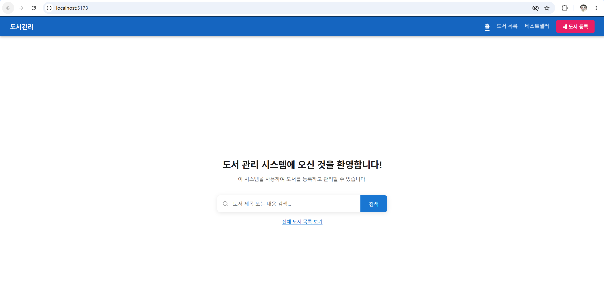
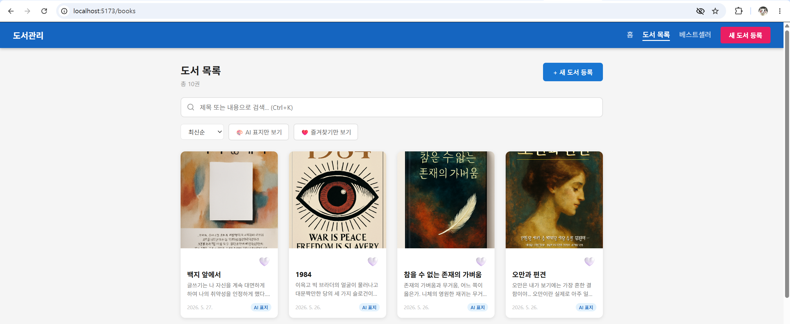
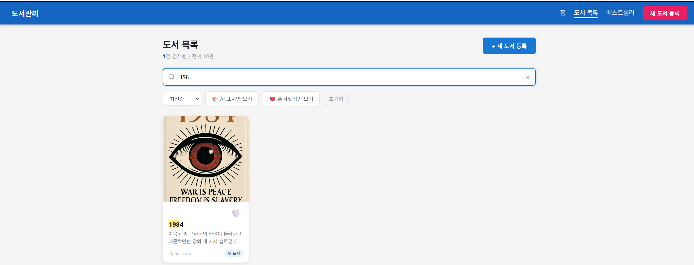
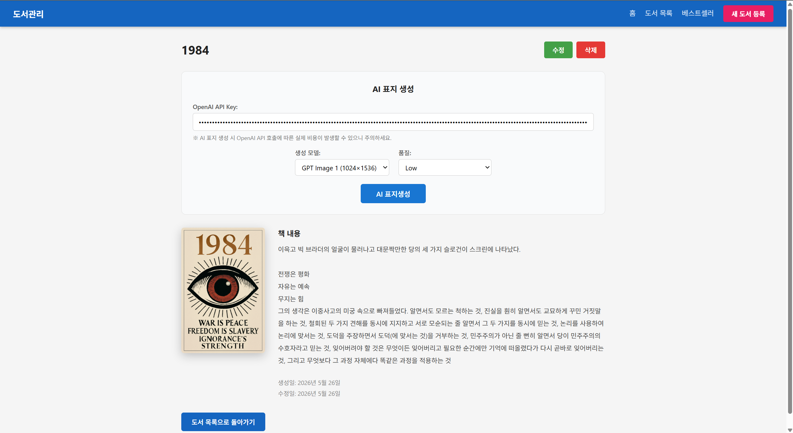
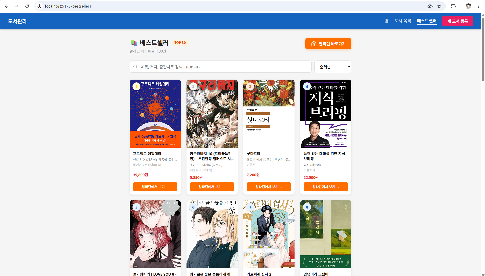

# KT_AIVLE_MiniProject4

# 🌐 Git-flow

- **main**: 프로젝트가 최종적으로 배포되는 브랜치
- **develop**: 다음 출시 버전을 개발하는 브랜치
- **feature**: 기능을 개발하는 브랜치

# 📌 Git branch 규칙

- 개인 작업은 꼭 feature 브랜치에서 하기
- 모든 작업 시작 전 develop에서 pull 받은 후 feature 브랜치에서 작업 시작
- 작업 완료 후 feature 브랜치에서 PR로 develop에 merge
- 프로젝트 완료 후 main으로 merge

# 📝 Feature Branch 네이밍

- feature/이름-기능제목#이슈번호
- 예: feature/krong-login#1
- develop merge 전 PR reviewers 팀원 1명 이상 설정 후 approve
- PR 후 팀원 공지

# 🎯 Commit Convention

- 커밋 메시지: #issue number + 깃모지 + 소문자 태그: 메시지

## Commit Tags

🎉 start: Start New Project [:tada:]  
✨ feat: 새로운 기능 추가 [:sparkles:]  
🐛 fix: 버그 수정 [:bug:]  
🎨 design: CSS/UI 디자인 변경 [:art:]  
♻️ refactor: 코드 리팩토링 [:recycle:]  
🔧 settings: 설정 파일 변경 [:wrench:]  
🗃️ comment: 주석 추가/변경 [:card_file_box:]  
➕ dependency/plugin: 라이브러리/플러그인 추가 [:heavy_plus_sign:]  
📝 docs: 문서 수정 [:memo:]  
🔀 merge: 브랜치 병합 [:twisted_rightwards_arrows:]  
🚀 deploy: 배포 [:rocket:]  
🚚 rename: 파일/폴더명 수정/이동 [:truck:]  
🔥 remove: 파일 삭제 [:fire:]  
⏪️ revert: 이전 버전으로 롤백 [:rewind:]


# AI 기반 도서 관리 시스템 (Book Management System)

본 프로젝트는 **React(Vite)** 기반의 프론트엔드와 **json-server** 및 **Web Scraper** 기반의 백엔드가 결합된 레포지토리입니다. 로컬 개발 환경과 프로덕션 배포 환경(Vercel)에 모두 대응할 수 있도록 유연하게 설계되어 있습니다.

---

## 1. 서비스 기본 구조 및 실행 방법

### 서비스 기본 구조
* **프론트엔드 (React)**
  * `react-router-dom`을 활용하여 효율적인 클라이언트 사이드 라우팅(SPA)을 구현했습니다.
  * 유기적인 상태 관리와 비동기 API 통신을 통해 컴포넌트 단위의 동적인 UI/UX를 제공합니다.
* **백엔드 (json-server & Web Scraper 서버)**
  * `server.js` 파일은 Vercel 서버리스 함수(Serverless Functions) 환경에서 원활하게 동작할 수 있도록 `json-server`를 래핑(Wrapping)하여 가상 REST API를 제공합니다.
  * `cheerio` 라이브러리를 활용해 교보문고의 실시간 베스트셀러 데이터를 스크래핑(Scraping)하는 앤드포인트를 구축하여 제공합니다.
  * 독립형 서버 파일인 `bestseller.js`를 통해 알라딘 오픈 API를 연동하고 데이터를 정제하여 송신할 수 있는 확장 구조를 가집니다.
  * 초기 데이터(`상록수`)를 메모리에 인라인 형태로 적재하여 시작합니다.

> ⚠️ **주의 (Data Persistence)**
> 백엔드의 데이터는 **인메모리(In-memory)** 방식으로 저장되므로, Vercel 서버가 Cold Start(재시작)될 때마다 모든 데이터가 초기 상태로 초기화됩니다. 실제 서비스 운영 및 영구 저장을 위해서는 MongoDB, PostgreSQL 등 실제 데이터베이스(DB) 연결이 필요합니다.

### 라우팅 구조
| 경로 (Path) | 연결 페이지 (Component) | 주요 기능 |
| :--- | :--- | :--- |
| `/` | `HomePage` | 서비스 시작 및 웰컴 페이지 |
| `/books` | `BookListPage` | 등록된 도서 전체 목록 조회 (검색 및 즐겨찾기 필터링) |
| `/books/new` | `BookFormPage` | 새 도서 등록 (Create 모드) |
| `/books/:id` | `BookDetailPage` | 특정 도서 상세 조회 및 AI 표지 생성 기능 |
| `/books/:id/edit` | `BookFormPage` | 기존 도서 정보 수정 (Edit 모드) |
| `/bestsellers` | `BestsellerPage` | 교보문고/알라딘 연동 실시간 베스트셀러 TOP 100 조회 |

### 로컬 환경 실행 방법 가이드

포트가 완전히 분리된 멀티 백엔드 구조이므로 **반드시 총 2개의 독립된 터미널**에서 아래 순서대로 구동해야 합니다.

#### [Step 1] 환경 변수 (.env) 설정
`api` 폴더 내부에 `.env` 파일을 생성하고 아래와 같이 포트 및 알라딘 Key 설정을 입력합니다.
```env
PORT=3000
BESTSELLER_PORT=3001
ALADIN_API_KEY=발급받은_알라딘_TTB_키
```

#### [Step 2] 멀티 백엔드 서버 기동 (터미널 ① 사용)
터미널 ① : 메인 가상 DB 서버 기동 (3001번 포트)
```
cd api
node server.js
```

#### [Step 3] 프론트엔드 리액트 앱 기동 (터미널 ② 사용)
터미널 ② : 프론트엔드 개발 서버 기동 (5173번 포트)
```
npm install
npm run dev
```

> 💡 Tip: Vite 프록시(vite.config.js) 테이블 레이아웃을 안전하게 매핑했으므로, 설정 수정 시에는 프론트엔드 터미널을 반드시 재기동(Ctrl+C 후 재시작)해야 프록시가 올바르게 작동합니다.

---

## 2. 조회 기능 연동 (Read API)

모든 데이터 조회(Read) 요청은 `api.js` 내부의 `request()` 공통 헬퍼 함수를 호출하여 구조적인 중복 코드를 방지합니다.

### ① 전체 도서 목록 조회
* **함수명**: `getBooks()`
* **HTTP Method / URL**: `GET /api/books`
* **연동 컴포넌트**: `BookListPage.jsx`
* **동작 및 UI 반영**:
  * 페이지 마운트 시 `load()` 비동기 함수가 트리거되어 데이터베이스 내부의 전체 도서 배열을 호출합니다.
  * 가져온 도서 객체의 총 개수를 리스트 상단에 `총 X권` 형태로 출력합니다.
  * `filterFavorite` 상태값과 `useMemo`를 활용해 사용자가 하트(❤️)를 누른 즐겨찾기 도서만 목록에 즉시 필터링하여 렌더링하는 클라이언트 사이드 instant 필터 로직을 지원합니다.
  * 등록된 도서 데이터가 존재하지 않을 경우, "등록된 도서가 없습니다. 첫 번째 도서를 등록해보세요!" 문구와 함께 **엠프티 상태(Empty State) UI**를 노출합니다.
  * `<BookCard />` 컴포넌트는 각 도서 객체의 `coverImageUrl` 필드 존재 여부를 확인합니다. 이미지가 있으면 **"AI 표지"**, 없으면 **"표지 없음"** 배지를 카드 우측 하단에 부착합니다. 표지가 없을 때는 도서 제목의 첫 글자 유니코드를 분석하여 랜덤 배경색의 기본 책 이모지(📚) 플레이스홀더를 동적으로 생성합니다.

### ② 특정 도서 상세 조회
* **함수명**: `getBook(id)`
* **HTTP Method / URL**: `GET /api/books/:id`
* **연동 컴포넌트**: `BookDetailPage.jsx`, `BookFormPage.jsx`
* **동작 및 UI 반영**:
  * **상세 페이지 (`BookDetailPage`)**: 라우터 URL 파라미터에서 추출한 `id` 값으로 데이터를 단건 조회하여 제목, 내용, 생성일/수정일, AI 표지 이미지를 화면에 바인딩합니다.
  * **수정 페이지 (`BookFormPage`)**: 컴포넌트가 수정 모드(`isEdit = true`)로 진입할 시, 기존 필드 데이터를 Form 인풋에 미리 프리셋(Preset)하기 위해 본 API를 호출합니다. 네트워크 장애 등으로 데이터 로드 실패 시 경고창(`alert`)을 출력한 후 도서 목록 페이지(`/books`)로 강제 리다이렉트 처리합니다.

### ③ 실시간 베스트셀러 목록 조회
* **HTTP Method / URL**: `GET /api/bestsellers`
* **연동 컴포넌트**: `BestSellerPage.jsx`
* **동작 및 UI 반영**:
  * 페이지 진입 시 백엔드 파싱 서버(교보문고 라이브 스크래핑 혹은 알라딘 API)로부터 인기 도서 100권의 데이터를 fresh fetch로 호출합니다.
  * 가져온 데이터에서 순위(Rank) 배지, 도서 커버, 제목, 저자, 출판사, 판매 가격을 추출하여 실시간 카드 그리드로 출력합니다.
  * 클라이언트 단에서 정규표현식을 통해 **제목/저자/출판사 통합 검색어 하이라이팅 기능**을 지원하며, 순위순·제목순·가격순(오름차순/내림차순) 정렬 기능을 동적으로 제공합니다.

---

## 3. 등록 · 수정 · 삭제 연동 (CUD API)

데이터를 변경하는 핵심 CUD 액션은 사용자 입력 폼 유효성 검사(Validation) 및 로딩/완료 피드백 토스트 디자인과 타이트하게 연동되어 구동됩니다.

### ① 도서 등록 (Create)
* **함수명**: `createBook(data)`
* **HTTP Method / URL**: `POST /api/books`
* **연동 컴포넌트**: `BookFormPage.jsx` (등록 모드)
* **동작 및 특징**:
  * 사용자가 입력을 마치고 제출 시, 공백 제거 후 빈 값이 있는지 검증하는 `validate()` 함수를 실행합니다. 누락 필드가 발견되면 해당 인풋 박스에 붉은 테두리 강조와 함께 안내 에러 메시지가 표시됩니다.
  * 등록 요청 시 백엔드로 빌드되는 데이터 바디에 `coverImageUrl: null` 속성과 클라이언트 기준 현재 시간의 ISO 8601 문자열(`createdAt`, `updatedAt`)을 자동으로 추가 적재하여 데이터베이스에 `POST`합니다.
  * 생성이 정상적으로 성공하면 새로 발급된 도서 고유 ID의 상세 페이지(`/books/:id`)로 화면을 이동시킵니다.

### ② 도서 수정 (Update)
* **함수명**: `updateBook(id, data)`
* **HTTP Method / URL**: `PATCH /api/books/:id`
* **연동 컴포넌트**: `BookFormPage.jsx` (수정 모드), `BookDetailPage.jsx` (AI 표지 생성 및 확정 시), `BookListPage.jsx` (즐겨찾기 토글 시)
* **동작 및 특징**:
  * 기존 도서 양식 폼 데이터를 상태에 채운 뒤 수정을 진행하며, 등록 프로세스와 동일하게 필드 유효성 검사를 거칩니다.
  * 데이터 전송 시점의 현재 시각을 생성하여 `updatedAt` 속성에 새로 바인딩한 후 가상 DB 서버에 `PATCH` 형태로 부분 업데이트를 반영합니다.
  * `BookListPage` 내부의 각 도서 카드에서 하트 아이콘을 클릭할 때마다 즐겨찾기 상태(`favorite`)가 백엔드에 `PATCH` 메서드로 전달되어 데이터의 지속성이 보존됩니다.
  * 성공 시 수정 완료된 도서 상세 화면으로 되돌아가 변경 사항을 실시간 확인하도록 설계되었습니다.

### ③ 도서 삭제 (Delete)
* **함수명**: `deleteBook(id)`
* **HTTP Method / URL**: `DELETE /api/books/:id`
* **연동 컴포넌트**: `BookListPage.jsx` (카드 오버레이 삭제), `BookDetailPage.jsx` (상단 컨트롤 바 삭제)
* **동작 및 특징**:
  * 사용자의 오클릭으로 인한 데이터 파기를 예방하기 위해 브라우저 표준 `confirm()` 대화상자를 노출하여 최종 승인을 받습니다.
  * `BookListPage` 내에서 삭제를 시도할 경우, 불필요한 전체 리스트 재요청(Re-fetch) 네트워크 비용을 줄이기 위해 프론트엔드 단에서 `Array.prototype.filter()`를 사용해 상태 배열에서 해당 데이터를 즉시 영구 제외합니다.
  * `BookDetailPage` 내부에서 단건 삭제에 성공한 경우에는 완료 토스트 출력 후 자동으로 전체 도서 목록 화면(`/books`)으로 사용자를 이동시킵니다.

---

## 4. OpenAI AI 표지 생성 기능

`BookDetailPage.jsx` 컴포넌트에서 트리거할 수 있는 고급 인공지능 기능으로, 축적된 도서 메타데이터를 기반으로 표지 컨셉을 추론 및 렌더링한 후 자동으로 업데이트하는 파이프라인을 가집니다.

### 주요 사양 및 생성 모델 설정
* **지원 모델 세부 사양**
  * **`gpt-image-1`**: 세로형 도서 커버 규격에 적합한 **1024x1536** 해상도를 사용하며, 품질 옵션(`low`, `medium`, `high`) 조정을 지원합니다.
  * **`dall-e-3`**: **1024x1792** 해상도를 사용합니다. 품질 옵션이 `high`일 경우 OpenAI 공식 규격인 `hd` 모드로 매핑하며, 그 외 옵션은 `standard` 해상도로 내부 변환 처리합니다.
* **프롬프트 자동 구성 (Prompt Engineering)**
  * 도서 오브젝트 내부에 저장된 `title`(제목)과 `description`(내용 요약 및 키워드) 속성을 활용하여 고품질 단행본 서적에 어울리는 최적의 디자인 프롬프트 텍스트를 자동 빌드해 OpenAI 측에 전송합니다.
  * *Prompt Template 예시: "A professional, artistic book cover for a book titled "{title}". Style: high-quality publisher design..."*

### API Key 인증 정보 관리 프로세스
1. 사용자가 이전에 발급 및 기입한 이력이 있는 키가 확인되면 브라우저 내부 저장소인 `localStorage`(`'openai_api_key'`) 로직에서 최우선으로 스캔하여 파싱합니다.
2. 로컬 스토리지 키가 부재할 경우, `useEffect` 사이드 이펙트 훅이 활성화되어 프론트엔드 내 public 경로의 `/api.txt` 파일에 비동기 네트워크 요청을 전달합니다.
3. 수신한 플레인 텍스트 스트림을 라인(Line) 단위로 분기하여 `OPENAI_API_KEY=` 패턴으로 매칭되는 문자열 키값을 확보한 후 애플리케이션의 공통 전역 상태(`apiKey`)에 자동 초기화합니다.

### 이미지 생성 및 가상 DB 영구 저장 실행 흐름
1. **클라이언트 유효성 판단**: 입력 파싱된 API Key 값이 공백이거나 올바른 접두사(`sk-`)로 시작하지 않는 비정상 형태일 경우 통신을 조기 차단하고 UI 단에 에러 메시지를 표시합니다.
2. **OpenAI 엔드포인트 요청**: 안전성 검증을 마친 인증 토큰을 Bearer 헤더에 할당한 후, OpenAI의 이미지 생성 API 표준 라우트(`POST https://api.openai.com/v1/images/generations`)로 정제된 Body 값을 송신합니다.
3. **네트워크 Fallback 구조**: 일부 엔터프라이즈 환경 및 네트워크 게이트웨이 이슈로 인해 `405 Method Not Allowed` 혹은 `Invalid method` 익셉션 에러 부근이 감지되면, 예외 처리 구문이 자동 개입하여 대안 엔드포인트 주소(`https://api.openai.com/v1/images/generate`)로 2차 재시도 통신을 감행하여 시스템 견고성을 확보합니다.
4. **Data URL 스트림 변환**: OpenAI AI 인스턴스가 반환한 압축 바이너리 데이터 `b64_json` 결과물을 추출해, 외부 이미지 호스팅 저장소 없이도 `` 태그에 결합하여 즉시 렌더링이 가능한 **Data URL 포맷(data:image/png;base64,...)** 스트림 문자열로 가공합니다.
5. **가상 DB 동기화 및 완성**: 가공이 완료된 Base64 데이터 스트림 문자열 주소를 기반으로 가상 백엔드 서버에 `PATCH /api/books/:id` 통신을 수행하여 데이터베이스 내 `coverImageUrl` 필드를 영구 동기화합니다. 연동이 끝나면 화면에 성공 안내 애니메이션 토스트(🎨)를 노출하고 뷰포트 영역의 이미지 컴포넌트를 부드럽게 새로 고침 처리합니다.
6. **실제 비용 발생 사전 고지**: 무분별한 API 호출로 인한 크레딧 소모를 방지하기 위해 UI 내부에 "AI 표지 생성 시 OpenAI API 호출에 따른 실제 비용이 발생할 수 있습니다"라는 주의 경고 문구를 명시하여 안전한 사용을 유도합니다.
7. **보안 전용 UI 마스킹**: 타인에게 API Key가 무단 노출되는 사고를 방지하기 위해 입력 인풋 필드를 type="password" 형태로 완벽하게 마스킹 처리했습니다.

---

## 5. 주요 화면 스크린샷 (Screenshots)
### 메인 홈 화면



### 도서 목록 및 검색



### 도서 상세 및 AI 표지 생성 영역


### 도서 등록


### 실시간 베스트셀러 (알라딘 API)
